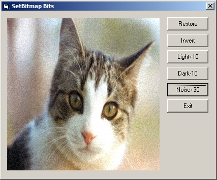



## SetBitmapBits

### Description

Hi this is a small example of using SetBitmapBits to play around with an image's pixels this is way faster than Pset or even SetPixel, anyway the code is commented hope you find it usfull like to say thanks to Ed Wilk for giveing me the idea.
 
### More Info
 

             |
---                |---
**Submitted On**   |2009-05-16 03:50:02
**By**             |[dreamvb](https://github.com/Planet-Source-Code/PSCIndex/blob/master/ByAuthor/dreamvb.md)
**Level**          |Beginner
**User Rating**    |5.0 (25 globes from 5 users)
**Compatibility**  |VB 6\.0
**Category**       |[Graphics](https://github.com/Planet-Source-Code/PSCIndex/blob/master/ByCategory/graphics__1-46.md)
**World**          |[Visual Basic](https://github.com/Planet-Source-Code/PSCIndex/blob/master/ByWorld/visual-basic.md)
**Archive File**   |[SetBitmapB2152475162009\.zip](https://github.com/Planet-Source-Code/dreamvb-setbitmapbits__1-72095/archive/master.zip)

